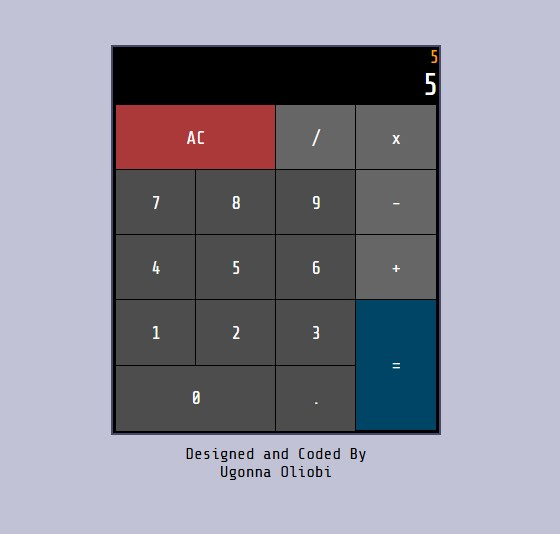

# Calculator App

A simple React-based calculator application that allows users to perform basic arithmetic operations efficiently.

## 🚀 Features

- Basic Arithmetic: Supports addition, subtraction, multiplication, and division.
- Live Calculation: Displays input dynamically and updates calculations instantly.
- Minimalist UI: Clean and user-friendly design.

## 🛠️ Technologies Used

- React.js
- JavaScript (ES6)
- HTML & CSS

## 📦 Installation

Clone the repository and install dependencies:
git clone https://github.com/your-repo/calculator-app.git
cd calculator-app
npm install

## ▶️ Usage

Run the application:
npm start

Open your browser and navigate to http://localhost:3000 to use the calculator.

## 📷 Screenshots

## 📜 License

This project is licensed under the MIT License.

## 👨‍💻 Author

Designed and coded by Ugonna Oliobi.
